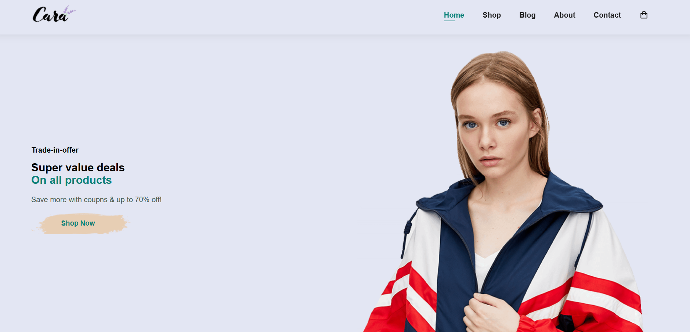

# E-Commerce Website

The E-Commerce Website is a modern online shopping platform with multiple pages that provide various functionalities and features.



## Table of Contents

- [Description](#description)
- [Pages](#pages)
  - [Home](#home)
  - [Shop](#shop)
  - [Blog](#blog)
  - [About](#about)
  - [Contact](#contact)
- [Usage](#usage)
- [Technologies Used](#technologies-used)
- [Contributing](#contributing)
- [License](#license)

## Description

The E-Commerce Website is a comprehensive platform built using HTML, CSS, and JavaScript. It includes a range of pages designed to create an engaging and user-friendly online shopping experience for customers.

## Pages

### Home

The Home page serves as the main landing page for the website. It introduces users to the store's offerings, showcases featured products, and promotes ongoing deals and promotions.

### Shop

The Shop page allows users to browse and explore the entire range of products available for purchase. It provides a user-friendly interface for users to filter and search for products based on various criteria.

### Blog

The Blog page is a space for the store to share informative and engaging content with customers. It could include articles about fashion trends, product reviews, styling tips, and more.

### About

The About page provides insight into the store's background, mission, values, and team. It helps users connect with the brand and understand its identity.

### Contact

The Contact page offers users a way to get in touch with the store. It includes contact information, such as address, phone numbers, and working hours, along with a contact form for inquiries.

## Usage

1. Navigate through the different pages using the navigation menu or links.

2. Explore the Home page to discover featured products and promotions.

3. Visit the Shop page to browse the entire product catalog and make purchases.

4. Read informative articles on the Blog page to stay updated on fashion trends and more.

5. Learn about the store's mission, values, and team on the About page.

6. Use the Contact page to get in touch with the store for any inquiries.

## Technologies Used

- HTML
- CSS
- JavaScript
- External libraries: Boxicons, Font Awesome

## Contributing

Contributions are welcome! If you have suggestions, improvements, or bug fixes, please submit a pull request.

1. Fork the repository.

2. Create a new branch:

   ```bash
   git checkout -b feature/your-feature-name
